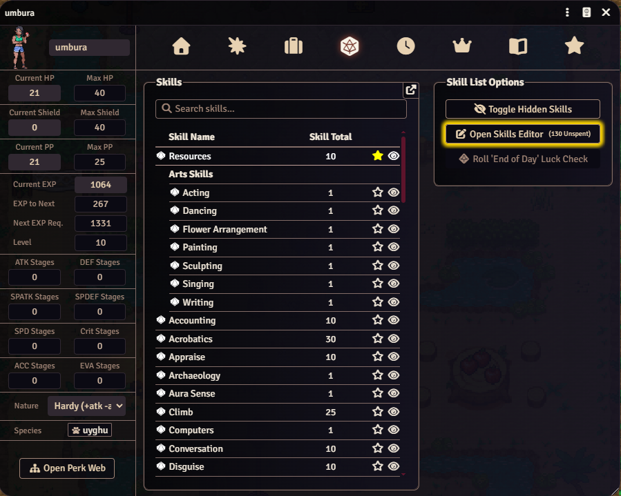

# PTR2e Skill Search Button

Foundry VTT module for Pokemon Tabletop Reunited: Evolved.

This module adds a live search control to PTR2e actor skill lists.

## Installation

Paste this manifest URL into Foundry's **Install Module** dialog:

`https://raw.githubusercontent.com/iago-aragao/ptr2e-skill-search-button/main/module.json`

## Features

- Inserts a search field above the actor skill list when the sheet renders.
- Adds a magnifying glass icon to the search field.
- Filters visible skills while the user types.
- Searches by skill slug and visible skill text.
- Hides empty skill groups while a search is active.
- Skips the favorite-only skill list to avoid redundant controls.
- Supports legacy `.skill-search-input` fields during migration so duplicate controls are not created.
- Does not alter actor data or PTR2e system files.

## Compatibility

- Foundry VTT: 14+
- System: Pokemon Tabletop Reunited: Evolved (PTR2e)

## Notes

- The module only registers hooks when the active system id is `ptr2e`.
- CSS classes and data flags use the `ptr2e-skill-search-button` prefix to avoid collisions with system styles.
